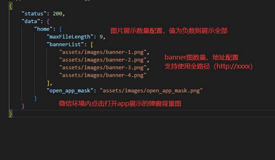

## 1、目录

 

## 2、技术栈

核心技术栈：JavaScript + CSS + HTML

核心框架：Vue3.0 + vue-route4.0 + vuex4.0

UI框架：vant3.4.9

其他依赖：axios、qs、core-js

 

## 3、路由配置

| Name   | Path    | Access address                  |
| ------ | ------- | ------------------------------- |
| 登录页 | #/login | http://www.xxx.com/beta/#/login |
| 主页   | #/home  | http://www.xxx.com/beta/        |

 

## 4、运行

①  在代码根目录打开终端窗口，输入 npm install 安装必要依赖

②  在终端窗口输入 npm run serve 即可运行项目

③  运行成功后，可通过 localhost:8080 访问

 

## 5、打包

①  在代码根目录打开终端窗口，输入 npm install 安装必要依赖

②  在终端窗口输入 npm run build 即可打包项目

③  打包成功后，项目根目录会生成 dist 文件夹，该文件夹即为项目打包后的文件

 

 

 

 

## 6、部署

### 方式一：直接把前端包扔到服务器

将项目打包生成 dist 文件后，将dist文件夹内所有文件复制到将要部署的位置的根目录下。

 

### 方式二：使用docker部署前端项目

 

 

前置条件：在linux环境内，已安装docker

 

1、首先进入宿主机终端命令行 启动docker

service docker start

 

2、安装Nginx

 

（1）拉取官方的最新版本的镜像

docker pull nginx:latest

 

（2）使用以下命令来查看是否已安装了 nginx：

docker images

 

（3）安装完成后，使用以下命令来运行 nginx 容器：

docker run --name nginx-test -p 8080:80 -d nginx

 

常用参数说明：

–NAME NGINX-TEST：容器名称。

-P 8080:80： 端口进行映射，将本地 8080 端口映射到容器内部的 80 端口。

-D NGINX： 设置容器在在后台一直运行。

 

3、安装node

 

（1）启动docker服务

systemctl start docker

 

（2）获取node最新镜像

docker pull node:latest

 

（3）查询拉取状态

docker images

 

（4）运行镜像

docker run -i -t node /bin/bash

 

常用参数说明：

-i：容器的标准输入保持打开

-t：让docker分配一个伪终端并绑定到容器的标准输入上

-p : 端口映射 格式为[主机端口：容器端口]

-d : 后台模式运行

-name : 给容器的起一个名字

-v：挂载主机的目录

 

（5）查看node版本号

node -v

 

4、安装vue-cli

npm install -g @vue/cli

 

5、进入h5项目根目录后安装相关依赖

npm install

 

6、将项目打包（项目根目录会生成一个dist文件夹，内部包含 Dockerfile 配置文件）

npm run build

 

7、基于 Dockerfile 配置文件构建 Vue 应用镜像（注意不要少了最后的 “.” ）

docker build -t vue-h5 .

 

8、查看镜像

docker image ls | grep vue-h5

 

9、基于 vue-h5 镜像启动 vueApp 容器

docker run -p 3000:80 -d --name vueApp vue-h5

 

常用参数说明：

-p 3000:80 端口映射，将宿主的3000端口映射到容器的80端口

-d 后台方式运行

–name 容器名

 

10、查看 Docker 进程

docker ps

 

 

 

 

## 7、配置静态资源

为了方便后期对图片展示数量的控制、以及方便替换banner图替，h5将从assets内的 config.json 读取部分配置。

 

注意：assets 文件夹需上传至项目部署的位置（同级目录下）

 

assets 文件内容如下：

 

config.json的配置如下：

